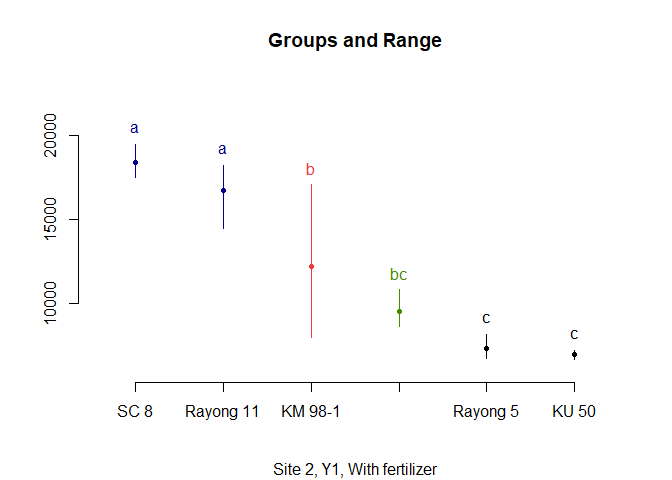

AUDPC and yield correlations
================
Erik Delaquis
4/10/2022

``` r
#Libraries
library(tidyverse)
library(ggrepel)
library(readxl)
library(agricolae)
```

# Y1

``` r
#Leaving here just in case we want to go back to disaggregating sites


#Y1
#Filter only site 1
Y1_S1 <- read_excel("data/3Y_for_ANOVA.xlsx",
                    sheet = "Y1") %>% filter(Site == 1)
Y1_S1
```

    ## # A tibble: 36 x 13
    ##    Var          Site   Rep Split_trt     Num_plnt Percent_inf_60 Percent_inf_150
    ##    <chr>       <dbl> <dbl> <chr>            <dbl>          <dbl>           <dbl>
    ##  1 KU 50           1     1 Without fert~        6           0               0   
    ##  2 Rayong 11       1     1 Without fert~       11           9.09            0   
    ##  3 Huaybong 60     1     1 Without fert~       10           0              10   
    ##  4 Rayong 5        1     1 Without fert~       12           0               0   
    ##  5 SC 8            1     1 Without fert~       12          16.7            41.7 
    ##  6 KM 98-1         1     1 Without fert~       11           0               9.09
    ##  7 KU 50           1     2 Without fert~       10           0               0   
    ##  8 Rayong 11       1     2 Without fert~       11           9.09            0   
    ##  9 Huaybong 60     1     2 Without fert~        6           0               0   
    ## 10 Rayong 5        1     2 Without fert~       12           0               0   
    ## # ... with 26 more rows, and 6 more variables: Percent_inf_270 <dbl>,
    ## #   Percent_inf_cul_60 <dbl>, Percent_inf_cul_150 <dbl>,
    ## #   Percent_inf_cul_270 <dbl>, Adj_yield_kg <dbl>, adjusted kg/plant <dbl>

``` r
DAP <- c(60, 150, 270)
ratings <-
  as.data.frame(Y1_S1[, c(9, 10, 11)]) #Have to transform into data frame for the next step to work
ratings
```

    ##    Percent_inf_cul_60 Percent_inf_cul_150 Percent_inf_cul_270
    ## 1            0.000000            0.000000            0.000000
    ## 2            9.090909            9.090909           36.363636
    ## 3            0.000000           10.000000           10.000000
    ## 4            0.000000            0.000000            0.000000
    ## 5           16.666667           58.333333           91.666667
    ## 6            0.000000            9.090909            9.090909
    ## 7            0.000000            0.000000            0.000000
    ## 8            9.090909            9.090909           63.636364
    ## 9            0.000000            0.000000            0.000000
    ## 10           0.000000            0.000000            8.333333
    ## 11          11.111111           44.444444           88.888889
    ## 12           0.000000           10.000000           20.000000
    ## 13           0.000000            0.000000            0.000000
    ## 14           0.000000            0.000000           50.000000
    ## 15           0.000000            0.000000            0.000000
    ## 16           0.000000            0.000000            0.000000
    ## 17           0.000000           63.636364          100.000000
    ## 18           0.000000            0.000000            0.000000
    ## 19           0.000000            0.000000            0.000000
    ## 20           0.000000            9.090909           45.454545
    ## 21           0.000000           20.000000           20.000000
    ## 22           0.000000            9.090909            9.090909
    ## 23          25.000000           66.666667           91.666667
    ## 24           0.000000            0.000000            0.000000
    ## 25           0.000000            0.000000            9.090909
    ## 26          18.181818           18.181818           63.636364
    ## 27           0.000000           33.333333           33.333333
    ## 28           0.000000           11.111111           11.111111
    ## 29          16.666667           66.666667           91.666667
    ## 30           0.000000            0.000000            0.000000
    ## 31           0.000000            0.000000            0.000000
    ## 32           0.000000           25.000000           25.000000
    ## 33           0.000000           22.222222           22.222222
    ## 34           0.000000            8.333333            8.333333
    ## 35          27.272727           90.909091          100.000000
    ## 36           0.000000            0.000000           11.111111

``` r
#Calculate absolute and relative AUDPC ratings and bind them on the end of the data set
audpc.abs.Y1_S1 <-
  audpc(ratings, DAP, type = "absolute") #Absolute AUDPC for ANOVA purposes
Y1_S1.AUDPC <-
  cbind(Y1_S1, audpc.abs.Y1_S1) %>% rename(audpc_absolute = audpc.abs.Y1_S1)

audpc.rel.Y1_S1 <- audpc(ratings, DAP, type = "relative")
Y1_S1.AUDPC <-
  cbind(Y1_S1.AUDPC, audpc.rel.Y1_S1) %>% rename(audpc_relative = audpc.rel.Y1_S1)
glimpse(Y1_S1.AUDPC)
```

    ## Rows: 36
    ## Columns: 15
    ## $ Var                 <chr> "KU 50", "Rayong 11", "Huaybong 60", "Rayong 5", "~
    ## $ Site                <dbl> 1, 1, 1, 1, 1, 1, 1, 1, 1, 1, 1, 1, 1, 1, 1, 1, 1,~
    ## $ Rep                 <dbl> 1, 1, 1, 1, 1, 1, 2, 2, 2, 2, 2, 2, 3, 3, 3, 3, 3,~
    ## $ Split_trt           <chr> "Without fertilizer", "Without fertilizer", "Witho~
    ## $ Num_plnt            <dbl> 6, 11, 10, 12, 12, 11, 10, 11, 6, 12, 9, 10, 8, 6,~
    ## $ Percent_inf_60      <dbl> 0.000000, 9.090909, 0.000000, 0.000000, 16.666667,~
    ## $ Percent_inf_150     <dbl> 0.000000, 0.000000, 10.000000, 0.000000, 41.666667~
    ## $ Percent_inf_270     <dbl> 0.000000, 27.272727, 0.000000, 0.000000, 33.333333~
    ## $ Percent_inf_cul_60  <dbl> 0.000000, 9.090909, 0.000000, 0.000000, 16.666667,~
    ## $ Percent_inf_cul_150 <dbl> 0.000000, 9.090909, 10.000000, 0.000000, 58.333333~
    ## $ Percent_inf_cul_270 <dbl> 0.000000, 36.363636, 10.000000, 0.000000, 91.66666~
    ## $ Adj_yield_kg        <dbl> 17.98596, 23.42954, 30.10449, 22.40000, 34.40000, ~
    ## $ `adjusted kg/plant` <dbl> 1.498830, 1.952461, 2.508707, 1.866667, 2.866667, ~
    ## $ audpc_absolute      <dbl> 0.0000, 3545.4545, 1650.0000, 0.0000, 12375.0000, ~
    ## $ audpc_relative      <dbl> 0.00000000, 0.16883117, 0.07857143, 0.00000000, 0.~

``` r
#Filter site 2
Y1_S2 <- read_excel("data/3Y_for_ANOVA.xlsx",
                    sheet = "Y1") %>% filter(Site == 2)
Y1_S2
```

    ## # A tibble: 36 x 13
    ##    Var          Site   Rep Split_trt     Num_plnt Percent_inf_60 Percent_inf_150
    ##    <chr>       <dbl> <dbl> <chr>            <dbl>          <dbl>           <dbl>
    ##  1 KU 50           2     1 Without fert~        9            0              0   
    ##  2 Rayong 11       2     1 Without fert~       10           20             70   
    ##  3 Huaybong 60     2     1 Without fert~       11           27.3            9.09
    ##  4 Rayong 5        2     1 Without fert~       10           20             10   
    ##  5 SC 8            2     1 Without fert~       11           54.5           36.4 
    ##  6 KM 98-1         2     1 Without fert~       12            0             16.7 
    ##  7 KU 50           2     2 Without fert~        9            0             33.3 
    ##  8 Rayong 11       2     2 Without fert~       11           27.3           63.6 
    ##  9 Huaybong 60     2     2 Without fert~       10           20             40   
    ## 10 Rayong 5        2     2 Without fert~       10           10             30   
    ## # ... with 26 more rows, and 6 more variables: Percent_inf_270 <dbl>,
    ## #   Percent_inf_cul_60 <dbl>, Percent_inf_cul_150 <dbl>,
    ## #   Percent_inf_cul_270 <dbl>, Adj_yield_kg <dbl>, adjusted kg/plant <dbl>

``` r
DAP <- c(60, 150, 270)
ratings <-
  as.data.frame(Y1_S2[, c(9, 10, 11)]) #Have to transform into data frame for the next step to work
ratings
```

    ##    Percent_inf_cul_60 Percent_inf_cul_150 Percent_inf_cul_270
    ## 1             0.00000             0.00000            66.66667
    ## 2            20.00000            90.00000           100.00000
    ## 3            27.27273            36.36364            72.72727
    ## 4            20.00000            30.00000            60.00000
    ## 5            54.54545            90.90909           100.00000
    ## 6             0.00000            16.66667            83.33333
    ## 7             0.00000            33.33333            77.77778
    ## 8            27.27273            90.90909           100.00000
    ## 9            20.00000            60.00000           100.00000
    ## 10           10.00000            40.00000            90.00000
    ## 11           55.55556           100.00000           100.00000
    ## 12           10.00000            30.00000           100.00000
    ## 13           27.27273            27.27273            36.36364
    ## 14           25.00000           100.00000           100.00000
    ## 15           16.66667            50.00000            91.66667
    ## 16           30.00000            60.00000            80.00000
    ## 17           22.22222            88.88889           100.00000
    ## 18            0.00000            25.00000            66.66667
    ## 19            0.00000            27.27273            72.72727
    ## 20           58.33333            91.66667           100.00000
    ## 21           25.00000            50.00000            75.00000
    ## 22            0.00000            36.36364            54.54545
    ## 23           40.00000           100.00000           100.00000
    ## 24           60.00000            80.00000           100.00000
    ## 25           33.33333            33.33333            33.33333
    ## 26           41.66667            91.66667           100.00000
    ## 27           11.11111            33.33333            77.77778
    ## 28           18.18182            18.18182            90.90909
    ## 29           66.66667           100.00000           100.00000
    ## 30           30.00000            40.00000           100.00000
    ## 31           11.11111            33.33333            44.44444
    ## 32           18.18182            72.72727           100.00000
    ## 33           18.18182            36.36364            72.72727
    ## 34           25.00000            25.00000            50.00000
    ## 35           22.22222           100.00000           100.00000
    ## 36           16.66667            16.66667            91.66667

``` r
#Calculate absolute and relative AUDPC ratings and bind them on the end of the data set
audpc.abs.Y1_S2 <-
  audpc(ratings, DAP, type = "absolute") #Absolute AUDPC for ANOVA purposes
Y1_S2.AUDPC <-
  cbind(Y1_S2, audpc.abs.Y1_S2) %>% rename(audpc_absolute = audpc.abs.Y1_S2)

audpc.rel.Y1_S2 <- audpc(ratings, DAP, type = "relative")
Y1_S2.AUDPC <-
  cbind(Y1_S2.AUDPC, audpc.rel.Y1_S2) %>% rename(audpc_relative = audpc.rel.Y1_S2)
glimpse(Y1_S2.AUDPC)
```

    ## Rows: 36
    ## Columns: 15
    ## $ Var                 <chr> "KU 50", "Rayong 11", "Huaybong 60", "Rayong 5", "~
    ## $ Site                <dbl> 2, 2, 2, 2, 2, 2, 2, 2, 2, 2, 2, 2, 2, 2, 2, 2, 2,~
    ## $ Rep                 <dbl> 1, 1, 1, 1, 1, 1, 2, 2, 2, 2, 2, 2, 3, 3, 3, 3, 3,~
    ## $ Split_trt           <chr> "Without fertilizer", "Without fertilizer", "Witho~
    ## $ Num_plnt            <dbl> 9, 10, 11, 10, 11, 12, 9, 11, 10, 10, 9, 10, 11, 8~
    ## $ Percent_inf_60      <dbl> 0.00000, 20.00000, 27.27273, 20.00000, 54.54545, 0~
    ## $ Percent_inf_150     <dbl> 0.000000, 70.000000, 9.090909, 10.000000, 36.36363~
    ## $ Percent_inf_270     <dbl> 66.666667, 10.000000, 36.363636, 30.000000, 9.0909~
    ## $ Percent_inf_cul_60  <dbl> 0.00000, 20.00000, 27.27273, 20.00000, 54.54545, 0~
    ## $ Percent_inf_cul_150 <dbl> 0.00000, 90.00000, 36.36364, 30.00000, 90.90909, 1~
    ## $ Percent_inf_cul_270 <dbl> 66.66667, 100.00000, 72.72727, 60.00000, 100.00000~
    ## $ Adj_yield_kg        <dbl> 47.68959, 27.02562, 28.96743, 18.58724, 33.86633, ~
    ## $ `adjusted kg/plant` <dbl> 3.974133, 2.252135, 2.413952, 1.548937, 2.822194, ~
    ## $ audpc_absolute      <dbl> 4000.000, 16350.000, 9409.091, 7650.000, 18000.000~
    ## $ audpc_relative      <dbl> 0.1904762, 0.7785714, 0.4480519, 0.3642857, 0.8571~

## Processing Y1 data - combining both sites

``` r
#data prep

#Using the file prepared with all 3 years called 3Y_for_ANOVA
#Load data from excel workbook
Y1 <- read_excel("data/3Y_for_ANOVA.xlsx",
                 sheet = "Y1")
ratings <-
  as.data.frame(Y1[, c(9, 10, 11)]) #Have to transform into data frame for the next step to work
ratings
```

    ##    Percent_inf_cul_60 Percent_inf_cul_150 Percent_inf_cul_270
    ## 1            0.000000            0.000000            0.000000
    ## 2            9.090909            9.090909           36.363636
    ## 3            0.000000           10.000000           10.000000
    ## 4            0.000000            0.000000            0.000000
    ## 5           16.666667           58.333333           91.666667
    ## 6            0.000000            9.090909            9.090909
    ## 7            0.000000            0.000000            0.000000
    ## 8            9.090909            9.090909           63.636364
    ## 9            0.000000            0.000000            0.000000
    ## 10           0.000000            0.000000            8.333333
    ## 11          11.111111           44.444444           88.888889
    ## 12           0.000000           10.000000           20.000000
    ## 13           0.000000            0.000000            0.000000
    ## 14           0.000000            0.000000           50.000000
    ## 15           0.000000            0.000000            0.000000
    ## 16           0.000000            0.000000            0.000000
    ## 17           0.000000           63.636364          100.000000
    ## 18           0.000000            0.000000            0.000000
    ## 19           0.000000            0.000000            0.000000
    ## 20           0.000000            9.090909           45.454545
    ## 21           0.000000           20.000000           20.000000
    ## 22           0.000000            9.090909            9.090909
    ## 23          25.000000           66.666667           91.666667
    ## 24           0.000000            0.000000            0.000000
    ## 25           0.000000            0.000000            9.090909
    ## 26          18.181818           18.181818           63.636364
    ## 27           0.000000           33.333333           33.333333
    ## 28           0.000000           11.111111           11.111111
    ## 29          16.666667           66.666667           91.666667
    ## 30           0.000000            0.000000            0.000000
    ## 31           0.000000            0.000000            0.000000
    ## 32           0.000000           25.000000           25.000000
    ## 33           0.000000           22.222222           22.222222
    ## 34           0.000000            8.333333            8.333333
    ## 35          27.272727           90.909091          100.000000
    ## 36           0.000000            0.000000           11.111111
    ## 37           0.000000            0.000000           66.666667
    ## 38          20.000000           90.000000          100.000000
    ## 39          27.272727           36.363636           72.727273
    ## 40          20.000000           30.000000           60.000000
    ## 41          54.545455           90.909091          100.000000
    ## 42           0.000000           16.666667           83.333333
    ## 43           0.000000           33.333333           77.777778
    ## 44          27.272727           90.909091          100.000000
    ## 45          20.000000           60.000000          100.000000
    ## 46          10.000000           40.000000           90.000000
    ## 47          55.555556          100.000000          100.000000
    ## 48          10.000000           30.000000          100.000000
    ## 49          27.272727           27.272727           36.363636
    ## 50          25.000000          100.000000          100.000000
    ## 51          16.666667           50.000000           91.666667
    ## 52          30.000000           60.000000           80.000000
    ## 53          22.222222           88.888889          100.000000
    ## 54           0.000000           25.000000           66.666667
    ## 55           0.000000           27.272727           72.727273
    ## 56          58.333333           91.666667          100.000000
    ## 57          25.000000           50.000000           75.000000
    ## 58           0.000000           36.363636           54.545455
    ## 59          40.000000          100.000000          100.000000
    ## 60          60.000000           80.000000          100.000000
    ## 61          33.333333           33.333333           33.333333
    ## 62          41.666667           91.666667          100.000000
    ## 63          11.111111           33.333333           77.777778
    ## 64          18.181818           18.181818           90.909091
    ## 65          66.666667          100.000000          100.000000
    ## 66          30.000000           40.000000          100.000000
    ## 67          11.111111           33.333333           44.444444
    ## 68          18.181818           72.727273          100.000000
    ## 69          18.181818           36.363636           72.727273
    ## 70          25.000000           25.000000           50.000000
    ## 71          22.222222          100.000000          100.000000
    ## 72          16.666667           16.666667           91.666667

``` r
DAP <- c(60, 150, 270)

audpc.abs.Y1 <-
  audpc(ratings, DAP, type = "absolute") #Absolute AUDPC for ANOVA purposes
Y1.AUDPC <-
  cbind(Y1, audpc.abs.Y1) %>% rename(audpc_absolute = audpc.abs.Y1)

audpc.rel.Y1 <- audpc(ratings, DAP, type = "relative")
Y1.AUDPC <-
  cbind(Y1.AUDPC, audpc.rel.Y1) %>% rename(audpc_relative = audpc.rel.Y1)
glimpse(Y1.AUDPC)
```

    ## Rows: 72
    ## Columns: 15
    ## $ Var                 <chr> "KU 50", "Rayong 11", "Huaybong 60", "Rayong 5", "~
    ## $ Site                <dbl> 1, 1, 1, 1, 1, 1, 1, 1, 1, 1, 1, 1, 1, 1, 1, 1, 1,~
    ## $ Rep                 <dbl> 1, 1, 1, 1, 1, 1, 2, 2, 2, 2, 2, 2, 3, 3, 3, 3, 3,~
    ## $ Split_trt           <chr> "Without fertilizer", "Without fertilizer", "Witho~
    ## $ Num_plnt            <dbl> 6, 11, 10, 12, 12, 11, 10, 11, 6, 12, 9, 10, 8, 6,~
    ## $ Percent_inf_60      <dbl> 0.000000, 9.090909, 0.000000, 0.000000, 16.666667,~
    ## $ Percent_inf_150     <dbl> 0.000000, 0.000000, 10.000000, 0.000000, 41.666667~
    ## $ Percent_inf_270     <dbl> 0.000000, 27.272727, 0.000000, 0.000000, 33.333333~
    ## $ Percent_inf_cul_60  <dbl> 0.000000, 9.090909, 0.000000, 0.000000, 16.666667,~
    ## $ Percent_inf_cul_150 <dbl> 0.000000, 9.090909, 10.000000, 0.000000, 58.333333~
    ## $ Percent_inf_cul_270 <dbl> 0.000000, 36.363636, 10.000000, 0.000000, 91.66666~
    ## $ Adj_yield_kg        <dbl> 17.98596, 23.42954, 30.10449, 22.40000, 34.40000, ~
    ## $ `adjusted kg/plant` <dbl> 1.498830, 1.952461, 2.508707, 1.866667, 2.866667, ~
    ## $ audpc_absolute      <dbl> 0.0000, 3545.4545, 1650.0000, 0.0000, 12375.0000, ~
    ## $ audpc_relative      <dbl> 0.00000000, 0.16883117, 0.07857143, 0.00000000, 0.~

### Visualize data

``` r
ggplot(Y1.AUDPC, aes(x = Var, y = audpc_absolute, fill = Split_trt)) +
  geom_boxplot(position = position_dodge(0.8)) +
  geom_dotplot(binaxis = 'y',
               stackdir = 'center',
               position = position_dodge(0.8))
```

<!-- -->

``` r
ggplot(Y1.AUDPC, aes(x = Var, y = Adj_yield_kg, fill = Split_trt)) +
  geom_boxplot(position = position_dodge(0.8)) +
  geom_dotplot(binaxis = 'y',
               stackdir = 'center',
               position = position_dodge(0.8))
```

<!-- -->

### Line graphs for Y1 (both sites)

``` r
#Make sure to call the Y1.AUDPC from above (chunk starting at line 66)
#library for summarizing
library(doBy)

#First transform combined Y1 data into long format
Y1.AUDPC.gg <-
  Y1.AUDPC %>% select(
    Var,
    Site,
    Rep,
    "60" = Percent_inf_cul_60,
    "150" = Percent_inf_cul_150,
    "270" = Percent_inf_cul_270,
    audpc_absolute,
    audpc_relative
  ) %>%
  gather(DAP, Percent_inf, "60":"270", factor_key = TRUE)

library(gridExtra)
#Both together to allow use of faceting
Y1try <-
  summaryBy(Percent_inf ~ Var + DAP + Site,
            data = Y1.AUDPC.gg,
            FUN = c(length, mean, sd))

# Rename column change.length to just N
names(Y1try)[names(Y1try) == "Percent_inf.length"] <- "N"
# Calculate se for error bars using basic formula of sd/sqrt(N)
Y1try$Percent_inf.se <- Y1try$Percent_inf.sd / sqrt(Y1try$N)

Y1try_line <-
  ggplot(data = Y1try, aes(x = DAP, y = Percent_inf.mean, group = Var)) +
  geom_errorbar(
    aes(
      ymin = Percent_inf.mean - Percent_inf.se,
      ymax = Percent_inf.mean + Percent_inf.se
    ),
    width = .1
  ) +
  geom_line(aes(color = Var), size = 1) + ylim(0, 100) +
  geom_point(aes(color = Var), shape = 1, size = 3) +
  labs(color = 'Variety') +
  theme_classic()

Y1try_line + facet_grid(rows = vars(Site), labeller = label_both) +
  xlab("Days after planting (DAP)") +
  ylab("Percent infection")
```

<!-- -->

#### Separating sites

##### Y1 Site 1 no fertilizer (NF)

``` r
Y1.S1.NF <- read_excel("data/3Y_for_ANOVA.xlsx",
                       sheet = "Y1") %>% filter(Site == 1 &
                                                  Split_trt == "Without fertilizer")
DAP <- c(60, 150, 270)
ratings <-
  as.data.frame(Y1.S1.NF[, c(9, 10, 11)]) #Have to transform into data frame for the next step to work
ratings
```

    ##    Percent_inf_cul_60 Percent_inf_cul_150 Percent_inf_cul_270
    ## 1            0.000000            0.000000            0.000000
    ## 2            9.090909            9.090909           36.363636
    ## 3            0.000000           10.000000           10.000000
    ## 4            0.000000            0.000000            0.000000
    ## 5           16.666667           58.333333           91.666667
    ## 6            0.000000            9.090909            9.090909
    ## 7            0.000000            0.000000            0.000000
    ## 8            9.090909            9.090909           63.636364
    ## 9            0.000000            0.000000            0.000000
    ## 10           0.000000            0.000000            8.333333
    ## 11          11.111111           44.444444           88.888889
    ## 12           0.000000           10.000000           20.000000
    ## 13           0.000000            0.000000            0.000000
    ## 14           0.000000            0.000000           50.000000
    ## 15           0.000000            0.000000            0.000000
    ## 16           0.000000            0.000000            0.000000
    ## 17           0.000000           63.636364          100.000000
    ## 18           0.000000            0.000000            0.000000

``` r
relative <-
  audpc(ratings, DAP, type = "relative") #Calculating relative AUDPC for correlation with yield, as in the example
relative
```

    ##  [1] 0.00000000 0.16883117 0.07857143 0.00000000 0.58928571 0.07142857
    ##  [7] 0.00000000 0.24675325 0.00000000 0.02380952 0.50000000 0.10714286
    ## [13] 0.00000000 0.14285714 0.00000000 0.00000000 0.60389610 0.00000000

``` r
correlation(Y1.S1.NF$Adj_yield_kg, relative, method = "kendall")
```

    ## 
    ## Kendall's rank correlation tau
    ## 
    ## data: Y1.S1.NF$Adj_yield_kg and relative 
    ## z-norm =  0.9151322 p-value = 0.3601222 
    ## alternative hypothesis: true rho is not equal to 0
    ## sample estimates:
    ## tau
    ##  0.1663134

``` r
correlation(Y1.S1.NF$Adj_yield_kg, Y1.S1.NF$Percent_inf_cul_60, method =
              "kendall")
```

    ## 
    ## Kendall's rank correlation tau
    ## 
    ## data: Y1.S1.NF$Adj_yield_kg and Y1.S1.NF$Percent_inf_cul_60 
    ## z-norm =  0.157604 p-value = 0.8747689 
    ## alternative hypothesis: true rho is not equal to 0
    ## sample estimates:
    ## tau
    ##  0.0310535

``` r
correlation(Y1.S1.NF$Adj_yield_kg, Y1.S1.NF$Percent_inf_cul_150, method =
              "kendall")
```

    ## 
    ## Kendall's rank correlation tau
    ## 
    ## data: Y1.S1.NF$Adj_yield_kg and Y1.S1.NF$Percent_inf_cul_150 
    ## z-norm =  1.007609 p-value = 0.3136421 
    ## alternative hypothesis: true rho is not equal to 0
    ## sample estimates:
    ## tau
    ##  0.1902606

``` r
correlation(Y1.S1.NF$Adj_yield_kg, Y1.S1.NF$Percent_inf_cul_270, method =
              "kendall")
```

    ## 
    ## Kendall's rank correlation tau
    ## 
    ## data: Y1.S1.NF$Adj_yield_kg and Y1.S1.NF$Percent_inf_cul_270 
    ## z-norm =  0.994709 p-value = 0.3198778 
    ## alternative hypothesis: true rho is not equal to 0
    ## sample estimates:
    ## tau
    ##  0.1807754

``` r
#Bind calculated absolute AUDPC to original and rename
audpc.Y1.S1.NF <-
  audpc(ratings, DAP, type = "absolute") #Absolute AUDPC for ANOVA purposes
Y1.S1.NF.AUDPC <-
  cbind(Y1.S1.NF, audpc.Y1.S1.NF) %>% rename(audpc = audpc.Y1.S1.NF)
glimpse(Y1.S1.NF.AUDPC)
```

    ## Rows: 18
    ## Columns: 14
    ## $ Var                 <chr> "KU 50", "Rayong 11", "Huaybong 60", "Rayong 5", "~
    ## $ Site                <dbl> 1, 1, 1, 1, 1, 1, 1, 1, 1, 1, 1, 1, 1, 1, 1, 1, 1,~
    ## $ Rep                 <dbl> 1, 1, 1, 1, 1, 1, 2, 2, 2, 2, 2, 2, 3, 3, 3, 3, 3,~
    ## $ Split_trt           <chr> "Without fertilizer", "Without fertilizer", "Witho~
    ## $ Num_plnt            <dbl> 6, 11, 10, 12, 12, 11, 10, 11, 6, 12, 9, 10, 8, 6,~
    ## $ Percent_inf_60      <dbl> 0.000000, 9.090909, 0.000000, 0.000000, 16.666667,~
    ## $ Percent_inf_150     <dbl> 0.000000, 0.000000, 10.000000, 0.000000, 41.666667~
    ## $ Percent_inf_270     <dbl> 0.000000, 27.272727, 0.000000, 0.000000, 33.333333~
    ## $ Percent_inf_cul_60  <dbl> 0.000000, 9.090909, 0.000000, 0.000000, 16.666667,~
    ## $ Percent_inf_cul_150 <dbl> 0.000000, 9.090909, 10.000000, 0.000000, 58.333333~
    ## $ Percent_inf_cul_270 <dbl> 0.000000, 36.363636, 10.000000, 0.000000, 91.66666~
    ## $ Adj_yield_kg        <dbl> 17.98596, 23.42954, 30.10449, 22.40000, 34.40000, ~
    ## $ `adjusted kg/plant` <dbl> 1.498830, 1.952461, 2.508707, 1.866667, 2.866667, ~
    ## $ audpc               <dbl> 0.000, 3545.455, 1650.000, 0.000, 12375.000, 1500.~

``` r
#ANOVA
Y1.S1.NF.model <-
  lm(audpc ~ Var + Rep + Var * Rep, data = Y1.S1.NF.AUDPC)
Y1.S1.NF.ANOVA <- anova(Y1.S1.NF.model) #ANOVA and print the results
Y1.S1.NF.ANOVA
```

    ## Analysis of Variance Table
    ## 
    ## Response: audpc
    ##           Df    Sum Sq  Mean Sq F value    Pr(>F)    
    ## Var        5 315808886 63161777 51.9627 7.357e-05 ***
    ## Rep        1    956905   956905  0.7872    0.4091    
    ## Var:Rep    5   1725174   345035  0.2839    0.9058    
    ## Residuals  6   7293131  1215522                      
    ## ---
    ## Signif. codes:  0 '***' 0.001 '**' 0.01 '*' 0.05 '.' 0.1 ' ' 1

``` r
Y1.S1.NF.aov = aov(Y1.S1.NF.model) #ANOVA and store the data for next use
```

``` r
##Can do post-hoc Tukey HSD with Agricolae package
Y1.S1.NF.TUKEY <- HSD.test(Y1.S1.NF.aov, trt = 'Var')
Y1.S1.NF.TUKEY
```

    ## $statistics
    ##   MSerror Df     Mean       CV      MSD
    ##   1215522  6 2954.672 37.31403 3582.631
    ## 
    ## $parameters
    ##    test name.t ntr StudentizedRange alpha
    ##   Tukey    Var   6         5.628353  0.05
    ## 
    ## $means
    ##                  audpc       std r   Min       Max       Q25       Q50
    ## Huaybong 60   550.0000  952.6279 3     0  1650.000     0.000     0.000
    ## KM 98-1      1250.0000 1145.6439 3     0  2250.000   750.000  1500.000
    ## KU 50           0.0000    0.0000 3     0     0.000     0.000     0.000
    ## Rayong 11    3909.0909 1135.4542 3  3000  5181.818  3272.727  3545.455
    ## Rayong 5      166.6667  288.6751 3     0   500.000     0.000     0.000
    ## SC 8        11852.2727 1181.1077 3 10500 12681.818 11437.500 12375.000
    ##                   Q75
    ## Huaybong 60   825.000
    ## KM 98-1      1875.000
    ## KU 50           0.000
    ## Rayong 11    4363.636
    ## Rayong 5      250.000
    ## SC 8        12528.409
    ## 
    ## $comparison
    ## NULL
    ## 
    ## $groups
    ##                  audpc groups
    ## SC 8        11852.2727      a
    ## Rayong 11    3909.0909      b
    ## KM 98-1      1250.0000     bc
    ## Huaybong 60   550.0000     bc
    ## Rayong 5      166.6667      c
    ## KU 50           0.0000      c
    ## 
    ## attr(,"class")
    ## [1] "group"

``` r
plot(Y1.S1.NF.TUKEY) + title(sub = "Site 1, Y1, No fertilizer")
```

<!-- -->

    ## numeric(0)

``` r
##Can also do Tukey HSD with multcompview package, output graph a little different. See https://www.r-graph-gallery.com/84-tukey-test.html
#library(multcompView)
# Tukey test to study each pair of treatment :
#Y1.S1.NF.TUKEYMult <- TukeyHSD(Y1.S1.NF.aov, "Var", conf.level=0.95)
#Y1.S1.NF.TUKEYMult

# Tukey test representation :
#plot(Y1.S1.NF.TUKEYMult , las=1 , col="brown")
```

##### Y1 Site 1 with fertilizer

``` r
Y1.S1.WF <- read_excel("data/3Y_for_ANOVA.xlsx",
                       sheet = "Y1") %>% filter(Site == 1 &
                                                  Split_trt == "With fertilizer")
DAP <- c(60, 150, 270)
ratings <-
  as.data.frame(Y1.S1.WF[, c(9, 10, 11)]) #Have to transform into data frame for the next step to work
ratings
```

    ##    Percent_inf_cul_60 Percent_inf_cul_150 Percent_inf_cul_270
    ## 1             0.00000            0.000000            0.000000
    ## 2             0.00000            9.090909           45.454545
    ## 3             0.00000           20.000000           20.000000
    ## 4             0.00000            9.090909            9.090909
    ## 5            25.00000           66.666667           91.666667
    ## 6             0.00000            0.000000            0.000000
    ## 7             0.00000            0.000000            9.090909
    ## 8            18.18182           18.181818           63.636364
    ## 9             0.00000           33.333333           33.333333
    ## 10            0.00000           11.111111           11.111111
    ## 11           16.66667           66.666667           91.666667
    ## 12            0.00000            0.000000            0.000000
    ## 13            0.00000            0.000000            0.000000
    ## 14            0.00000           25.000000           25.000000
    ## 15            0.00000           22.222222           22.222222
    ## 16            0.00000            8.333333            8.333333
    ## 17           27.27273           90.909091          100.000000
    ## 18            0.00000            0.000000           11.111111

``` r
relative <- audpc(ratings, DAP, type = "relative")
relative
```

    ##  [1] 0.00000000 0.17532468 0.15714286 0.07142857 0.64880952 0.00000000
    ##  [7] 0.02597403 0.31168831 0.26190476 0.08730159 0.63095238 0.00000000
    ## [13] 0.00000000 0.19642857 0.17460317 0.06547619 0.79870130 0.03174603

``` r
correlation(Y1.S1.WF$Adj_yield_kg, relative, method = "kendall")
```

    ## 
    ## Kendall's rank correlation tau
    ## 
    ## data: Y1.S1.WF$Adj_yield_kg and relative 
    ## z-norm =  -0.3051363 p-value = 0.7602623 
    ## alternative hypothesis: true rho is not equal to 0
    ## sample estimates:
    ## tau
    ##  -0.05351919

``` r
#Bind calculated absolute AUDPC to original and rename
audpc.Y1.S1.WF <-
  audpc(ratings, DAP, type = "absolute") #Absolute AUDPC for ANOVA purposes
Y1.S1.WF.AUDPC <-
  cbind(Y1.S1.WF, audpc.Y1.S1.WF) %>% rename(audpc = audpc.Y1.S1.WF)
glimpse(Y1.S1.WF.AUDPC)
```

    ## Rows: 18
    ## Columns: 14
    ## $ Var                 <chr> "KU 50", "Rayong 11", "Huaybong 60", "Rayong 5", "~
    ## $ Site                <dbl> 1, 1, 1, 1, 1, 1, 1, 1, 1, 1, 1, 1, 1, 1, 1, 1, 1,~
    ## $ Rep                 <dbl> 1, 1, 1, 1, 1, 1, 2, 2, 2, 2, 2, 2, 3, 3, 3, 3, 3,~
    ## $ Split_trt           <chr> "With fertilizer", "With fertilizer", "With fertil~
    ## $ Num_plnt            <dbl> 8, 11, 5, 11, 12, 11, 11, 11, 3, 9, 12, 11, 6, 8, ~
    ## $ Percent_inf_60      <dbl> 0.00000, 0.00000, 0.00000, 0.00000, 25.00000, 0.00~
    ## $ Percent_inf_150     <dbl> 0.000000, 9.090909, 20.000000, 9.090909, 41.666667~
    ## $ Percent_inf_270     <dbl> 0.000000, 36.363636, 0.000000, 0.000000, 25.000000~
    ## $ Percent_inf_cul_60  <dbl> 0.00000, 0.00000, 0.00000, 0.00000, 25.00000, 0.00~
    ## $ Percent_inf_cul_150 <dbl> 0.000000, 9.090909, 20.000000, 9.090909, 66.666667~
    ## $ Percent_inf_cul_270 <dbl> 0.000000, 45.454545, 20.000000, 9.090909, 91.66666~
    ## $ Adj_yield_kg        <dbl> 34.73253, 28.11545, 24.15487, 25.55950, 33.40000, ~
    ## $ `adjusted kg/plant` <dbl> 2.894377, 2.342954, 2.012906, 2.129958, 2.783333, ~
    ## $ audpc               <dbl> 0.0000, 3681.8182, 3300.0000, 1500.0000, 13625.000~

``` r
#ANOVA
Y1.S1.WF.model <-
  lm(audpc ~ Var + Rep + Var * Rep, data = Y1.S1.WF.AUDPC)
Y1.S1.WF.ANOVA <- anova(Y1.S1.NF.model) #ANOVA and print the results
Y1.S1.WF.ANOVA
```

    ## Analysis of Variance Table
    ## 
    ## Response: audpc
    ##           Df    Sum Sq  Mean Sq F value    Pr(>F)    
    ## Var        5 315808886 63161777 51.9627 7.357e-05 ***
    ## Rep        1    956905   956905  0.7872    0.4091    
    ## Var:Rep    5   1725174   345035  0.2839    0.9058    
    ## Residuals  6   7293131  1215522                      
    ## ---
    ## Signif. codes:  0 '***' 0.001 '**' 0.01 '*' 0.05 '.' 0.1 ' ' 1

``` r
Y1.S1.WF.aov = aov(Y1.S1.WF.model) #ANOVA and store the data for next use

##Can do post-hoc Tukey HSD with Agricolae package
Y1.S1.WF.TUKEY <- HSD.test(Y1.S1.WF.aov, trt = 'Var')
Y1.S1.WF.TUKEY
```

    ## $statistics
    ##   MSerror Df     Mean       CV      MSD
    ##   1712304  6 4243.729 30.83492 4252.175
    ## 
    ## $parameters
    ##    test name.t ntr StudentizedRange alpha
    ##   Tukey    Var   6         5.628353  0.05
    ## 
    ## $means
    ##                  audpc       std r       Min        Max       Q25       Q50
    ## Huaybong 60  4155.5556 1178.6684 3  3300.000  5500.0000  3483.333  3666.667
    ## KM 98-1       222.2222  384.9002 3     0.000   666.6667     0.000     0.000
    ## KU 50         181.8182  314.9183 3     0.000   545.4545     0.000     0.000
    ## Rayong 11    4784.0909 1541.3967 3  3681.818  6545.4545  3903.409  4125.000
    ## Rayong 5     1569.4444  236.9267 3  1375.000  1833.3333  1437.500  1500.000
    ## SC 8        14549.2424 1934.7015 3 13250.000 16772.7273 13437.500 13625.000
    ##                    Q75
    ## Huaybong 60  4583.3333
    ## KM 98-1       333.3333
    ## KU 50         272.7273
    ## Rayong 11    5335.2273
    ## Rayong 5     1666.6667
    ## SC 8        15198.8636
    ## 
    ## $comparison
    ## NULL
    ## 
    ## $groups
    ##                  audpc groups
    ## SC 8        14549.2424      a
    ## Rayong 11    4784.0909      b
    ## Huaybong 60  4155.5556     bc
    ## Rayong 5     1569.4444     bc
    ## KM 98-1       222.2222      c
    ## KU 50         181.8182      c
    ## 
    ## attr(,"class")
    ## [1] "group"

``` r
plot(Y1.S1.WF.TUKEY) + title(sub = "Site 1, Y1, With fertilizer")
```

<!-- -->

    ## numeric(0)

##### Y1 Site 2, Without fertilizer

``` r
Y1.S2.NF <- read_excel("data/3Y_for_ANOVA.xlsx",
                       sheet = "Y1") %>% filter(Site == 2 &
                                                  Split_trt == "Without fertilizer")
DAP <- c(60, 150, 270)
ratings <-
  as.data.frame(Y1.S2.NF[, c(9, 10, 11)]) #Have to transform into data frame for the next step to work
ratings
```

    ##    Percent_inf_cul_60 Percent_inf_cul_150 Percent_inf_cul_270
    ## 1             0.00000             0.00000            66.66667
    ## 2            20.00000            90.00000           100.00000
    ## 3            27.27273            36.36364            72.72727
    ## 4            20.00000            30.00000            60.00000
    ## 5            54.54545            90.90909           100.00000
    ## 6             0.00000            16.66667            83.33333
    ## 7             0.00000            33.33333            77.77778
    ## 8            27.27273            90.90909           100.00000
    ## 9            20.00000            60.00000           100.00000
    ## 10           10.00000            40.00000            90.00000
    ## 11           55.55556           100.00000           100.00000
    ## 12           10.00000            30.00000           100.00000
    ## 13           27.27273            27.27273            36.36364
    ## 14           25.00000           100.00000           100.00000
    ## 15           16.66667            50.00000            91.66667
    ## 16           30.00000            60.00000            80.00000
    ## 17           22.22222            88.88889           100.00000
    ## 18            0.00000            25.00000            66.66667

``` r
relative <- audpc(ratings, DAP, type = "relative")
relative
```

    ##  [1] 0.1904762 0.7785714 0.4480519 0.3642857 0.8571429 0.3214286 0.3888889
    ##  [8] 0.7987013 0.6285714 0.4785714 0.9047619 0.4571429 0.2987013 0.8392857
    ## [15] 0.5476190 0.5928571 0.7777778 0.3154762

``` r
correlation(Y1.S2.NF$Adj_yield_kg, relative, method = "kendall")
```

    ## 
    ## Kendall's rank correlation tau
    ## 
    ## data: Y1.S2.NF$Adj_yield_kg and relative 
    ## z-norm =  -1.174209 p-value = 0.2403114 
    ## alternative hypothesis: true rho is not equal to 0
    ## sample estimates:
    ## tau
    ##  -0.2026144

``` r
#Bind calculated absolute AUDPC to original and rename
audpc.Y1.S2.NF <-
  audpc(ratings, DAP, type = "absolute") #Absolute AUDPC for ANOVA purposes
Y1.S2.NF.AUDPC <-
  cbind(Y1.S2.NF, audpc.Y1.S2.NF) %>% rename(audpc = audpc.Y1.S2.NF)
glimpse(Y1.S2.NF.AUDPC)
```

    ## Rows: 18
    ## Columns: 14
    ## $ Var                 <chr> "KU 50", "Rayong 11", "Huaybong 60", "Rayong 5", "~
    ## $ Site                <dbl> 2, 2, 2, 2, 2, 2, 2, 2, 2, 2, 2, 2, 2, 2, 2, 2, 2,~
    ## $ Rep                 <dbl> 1, 1, 1, 1, 1, 1, 2, 2, 2, 2, 2, 2, 3, 3, 3, 3, 3,~
    ## $ Split_trt           <chr> "Without fertilizer", "Without fertilizer", "Witho~
    ## $ Num_plnt            <dbl> 9, 10, 11, 10, 11, 12, 9, 11, 10, 10, 9, 10, 11, 8~
    ## $ Percent_inf_60      <dbl> 0.00000, 20.00000, 27.27273, 20.00000, 54.54545, 0~
    ## $ Percent_inf_150     <dbl> 0.000000, 70.000000, 9.090909, 10.000000, 36.36363~
    ## $ Percent_inf_270     <dbl> 66.666667, 10.000000, 36.363636, 30.000000, 9.0909~
    ## $ Percent_inf_cul_60  <dbl> 0.00000, 20.00000, 27.27273, 20.00000, 54.54545, 0~
    ## $ Percent_inf_cul_150 <dbl> 0.00000, 90.00000, 36.36364, 30.00000, 90.90909, 1~
    ## $ Percent_inf_cul_270 <dbl> 66.66667, 100.00000, 72.72727, 60.00000, 100.00000~
    ## $ Adj_yield_kg        <dbl> 47.68959, 27.02562, 28.96743, 18.58724, 33.86633, ~
    ## $ `adjusted kg/plant` <dbl> 3.974133, 2.252135, 2.413952, 1.548937, 2.822194, ~
    ## $ audpc               <dbl> 4000.000, 16350.000, 9409.091, 7650.000, 18000.000~

``` r
#ANOVA
Y1.S2.NF.model <-
  lm(audpc ~ Var + Rep + Var * Rep, data = Y1.S2.NF.AUDPC)
Y1.S2.NF.ANOVA <- anova(Y1.S2.NF.model) #ANOVA and print the results
Y1.S2.NF.ANOVA
```

    ## Analysis of Variance Table
    ## 
    ## Response: audpc
    ##           Df    Sum Sq  Mean Sq F value    Pr(>F)    
    ## Var        5 342420834 68484167 21.5433 0.0009073 ***
    ## Rep        1   6230840  6230840  1.9601 0.2110355    
    ## Var:Rep    5  12267269  2453454  0.7718 0.6029990    
    ## Residuals  6  19073435  3178906                      
    ## ---
    ## Signif. codes:  0 '***' 0.001 '**' 0.01 '*' 0.05 '.' 0.1 ' ' 1

``` r
Y1.S2.NF.aov = aov(Y1.S2.NF.model) #ANOVA and store the data for next use

##Can do post-hoc Tukey HSD with Agricolae package
Y1.S2.NF.TUKEY <- HSD.test(Y1.S2.NF.aov, trt = 'Var')
Y1.S2.NF.TUKEY
```

    ## $statistics
    ##   MSerror Df     Mean      CV      MSD
    ##   3178906  6 11653.03 15.3003 5793.747
    ## 
    ## $parameters
    ##    test name.t ntr StudentizedRange alpha
    ##   Tukey    Var   6         5.628353  0.05
    ## 
    ## $means
    ##                 audpc       std r       Min       Max       Q25       Q50
    ## Huaybong 60 11369.697 1898.8107 3  9409.091 13200.000 10454.545 11500.000
    ## KM 98-1      7658.333 1682.6938 3  6625.000  9600.000  6687.500  6750.000
    ## KU 50        6146.465 2086.2010 3  4000.000  8166.667  5136.364  6272.727
    ## Rayong 11   16915.909  649.4475 3 16350.000 17625.000 16561.364 16772.727
    ## Rayong 5    10050.000 2400.0000 3  7650.000 12450.000  8850.000 10050.000
    ## SC 8        17777.778 1347.1506 3 16333.333 19000.000 17166.667 18000.000
    ##                   Q75
    ## Huaybong 60 12350.000
    ## KM 98-1      8175.000
    ## KU 50        7219.697
    ## Rayong 11   17198.864
    ## Rayong 5    11250.000
    ## SC 8        18500.000
    ## 
    ## $comparison
    ## NULL
    ## 
    ## $groups
    ##                 audpc groups
    ## SC 8        17777.778      a
    ## Rayong 11   16915.909     ab
    ## Huaybong 60 11369.697     bc
    ## Rayong 5    10050.000      c
    ## KM 98-1      7658.333      c
    ## KU 50        6146.465      c
    ## 
    ## attr(,"class")
    ## [1] "group"

``` r
plot(Y1.S2.NF.TUKEY) + title(sub = "Site 2, Y1, No fertilizer")
```

<!-- -->

    ## numeric(0)

##### Y1 Site 2, With fertilizer

``` r
Y1.S2.WF <- read_excel("data/3Y_for_ANOVA.xlsx",
                       sheet = "Y1") %>% filter(Site == 2 &
                                                  Split_trt == "With fertilizer")
DAP <- c(60, 150, 270)
ratings <-
  as.data.frame(Y1.S2.WF[, c(9, 10, 11)]) #Have to transform into data frame for the next step to work
ratings
```

    ##    Percent_inf_cul_60 Percent_inf_cul_150 Percent_inf_cul_270
    ## 1             0.00000            27.27273            72.72727
    ## 2            58.33333            91.66667           100.00000
    ## 3            25.00000            50.00000            75.00000
    ## 4             0.00000            36.36364            54.54545
    ## 5            40.00000           100.00000           100.00000
    ## 6            60.00000            80.00000           100.00000
    ## 7            33.33333            33.33333            33.33333
    ## 8            41.66667            91.66667           100.00000
    ## 9            11.11111            33.33333            77.77778
    ## 10           18.18182            18.18182            90.90909
    ## 11           66.66667           100.00000           100.00000
    ## 12           30.00000            40.00000           100.00000
    ## 13           11.11111            33.33333            44.44444
    ## 14           18.18182            72.72727           100.00000
    ## 15           18.18182            36.36364            72.72727
    ## 16           25.00000            25.00000            50.00000
    ## 17           22.22222           100.00000           100.00000
    ## 18           16.66667            16.66667            91.66667

``` r
relative <- audpc(ratings, DAP, type = "relative")
relative
```

    ##  [1] 0.3441558 0.8690476 0.5178571 0.3376623 0.8714286 0.8142857 0.3333333
    ##  [8] 0.8333333 0.4126984 0.3896104 0.9285714 0.5500000 0.3174603 0.6883117
    ## [15] 0.4285714 0.3214286 0.8333333 0.3809524

``` r
correlation(Y1.S2.WF$Adj_yield_kg, relative, method = "kendall")
```

    ## 
    ## Kendall's rank correlation tau
    ## 
    ## data: Y1.S2.WF$Adj_yield_kg and relative 
    ## z-norm =  -1.364576 p-value = 0.1723862 
    ## alternative hypothesis: true rho is not equal to 0
    ## sample estimates:
    ## tau
    ##  -0.2360668

``` r
#Bind calculated absolute AUDPC to original and rename
audpc.Y1.S2.WF <-
  audpc(ratings, DAP, type = "absolute") #Absolute AUDPC for ANOVA purposes
Y1.S2.WF.AUDPC <-
  cbind(Y1.S2.WF, audpc.Y1.S2.WF) %>% rename(audpc = audpc.Y1.S2.WF)
glimpse(Y1.S2.WF.AUDPC)
```

    ## Rows: 18
    ## Columns: 14
    ## $ Var                 <chr> "KU 50", "Rayong 11", "Huaybong 60", "Rayong 5", "~
    ## $ Site                <dbl> 2, 2, 2, 2, 2, 2, 2, 2, 2, 2, 2, 2, 2, 2, 2, 2, 2,~
    ## $ Rep                 <dbl> 1, 1, 1, 1, 1, 1, 2, 2, 2, 2, 2, 2, 3, 3, 3, 3, 3,~
    ## $ Split_trt           <chr> "With fertilizer", "With fertilizer", "With fertil~
    ## $ Num_plnt            <dbl> 11, 12, 12, 11, 10, 10, 6, 12, 9, 11, 9, 10, 9, 11~
    ## $ Percent_inf_60      <dbl> 0.00000, 58.33333, 25.00000, 0.00000, 40.00000, 60~
    ## $ Percent_inf_150     <dbl> 27.27273, 33.33333, 25.00000, 36.36364, 60.00000, ~
    ## $ Percent_inf_270     <dbl> 45.454545, 8.333333, 25.000000, 18.181818, 0.00000~
    ## $ Percent_inf_cul_60  <dbl> 0.00000, 58.33333, 25.00000, 0.00000, 40.00000, 60~
    ## $ Percent_inf_cul_150 <dbl> 27.27273, 91.66667, 50.00000, 36.36364, 100.00000,~
    ## $ Percent_inf_cul_270 <dbl> 72.72727, 100.00000, 75.00000, 54.54545, 100.00000~
    ## $ Adj_yield_kg        <dbl> 43.23815, 15.20000, 22.90000, 26.62447, 39.45512, ~
    ## $ `adjusted kg/plant` <dbl> 3.603179, 1.266667, 1.908333, 2.218706, 3.287927, ~
    ## $ audpc               <dbl> 7227.273, 18250.000, 10875.000, 7090.909, 18300.00~

``` r
#ANOVA
Y1.S2.WF.model <-
  lm(audpc ~ Var + Rep + Var * Rep, data = Y1.S2.WF.AUDPC)
Y1.S2.WF.ANOVA <- anova(Y1.S2.WF.model) #ANOVA and print the results
Y1.S2.WF.ANOVA
```

    ## Analysis of Variance Table
    ## 
    ## Response: audpc
    ##           Df    Sum Sq  Mean Sq F value    Pr(>F)    
    ## Var        5 350971948 70194390 78.1274 2.233e-05 ***
    ## Rep        1  22610482 22610482 25.1658  0.002412 ** 
    ## Var:Rep    5  28290317  5658063  6.2975  0.022221 *  
    ## Residuals  6   5390764   898461                      
    ## ---
    ## Signif. codes:  0 '***' 0.001 '**' 0.01 '*' 0.05 '.' 0.1 ' ' 1

``` r
Y1.S2.WF.aov = aov(Y1.S2.WF.model) #ANOVA and store the data for next use

##Can do post-hoc Tukey HSD with Agricolae package
Y1.S2.WF.TUKEY <- HSD.test(Y1.S2.WF.aov, trt = 'Var')
Y1.S2.WF.TUKEY
```

    ## $statistics
    ##    MSerror Df     Mean       CV      MSD
    ##   898460.6  6 11867.38 7.987201 3080.139
    ## 
    ## $parameters
    ##    test name.t ntr StudentizedRange alpha
    ##   Tukey    Var   6         5.628353  0.05
    ## 
    ## $means
    ##                 audpc       std r       Min       Max       Q25       Q50
    ## Huaybong 60  9513.889 1190.4812 3  8666.667 10875.000  8833.333  9000.000
    ## KM 98-1     12216.667 4586.4838 3  8000.000 17100.000  9775.000 11550.000
    ## KU 50        6964.646  281.9702 3  6666.667  7227.273  6833.333  7000.000
    ## Rayong 11   16734.848 2010.0899 3 14454.545 18250.000 15977.273 17500.000
    ## Rayong 5     7340.909  747.9310 3  6750.000  8181.818  6920.455  7090.909
    ## SC 8        18433.333 1006.6446 3 17500.000 19500.000 17900.000 18300.000
    ##                   Q75
    ## Huaybong 60  9937.500
    ## KM 98-1     14325.000
    ## KU 50        7113.636
    ## Rayong 11   17875.000
    ## Rayong 5     7636.364
    ## SC 8        18900.000
    ## 
    ## $comparison
    ## NULL
    ## 
    ## $groups
    ##                 audpc groups
    ## SC 8        18433.333      a
    ## Rayong 11   16734.848      a
    ## KM 98-1     12216.667      b
    ## Huaybong 60  9513.889     bc
    ## Rayong 5     7340.909      c
    ## KU 50        6964.646      c
    ## 
    ## attr(,"class")
    ## [1] "group"

``` r
plot(Y1.S2.WF.TUKEY) + title(sub = "Site 2, Y1, With fertilizer")
```

<!-- -->

    ## numeric(0)

## Y2

### All data

``` r
#data prep
Y2 <- read_excel("data/3Y_for_ANOVA.xlsx",
                 sheet = "Y2")
DAP <- c(60, 150, 270)
ratings <-
  as.data.frame(Y2[, c(10, 11, 12)]) #Have to transform into data frame for the next step to work
ratings
```

    ##    Percent_inf_cul_60 Percent_inf_cul_150 Percent_inf_cul_270
    ## 1            0.000000            0.000000           33.333333
    ## 2            0.000000           16.666667           16.666667
    ## 3           10.000000           10.000000           10.000000
    ## 4            0.000000           90.000000          100.000000
    ## 5           45.454545          100.000000          100.000000
    ## 6           54.545455           90.909091          100.000000
    ## 7           14.285714           28.571429           71.428571
    ## 8            0.000000            0.000000            0.000000
    ## 9            0.000000           27.272727           36.363636
    ## 10           0.000000           16.666667           25.000000
    ## 11           8.333333           50.000000           66.666667
    ## 12          66.666667           66.666667           66.666667
    ## 13          10.000000           90.000000          100.000000
    ## 14          33.333333           91.666667          100.000000
    ## 15         100.000000          100.000000          100.000000
    ## 16           0.000000           40.000000           50.000000
    ## 17           0.000000           25.000000           25.000000
    ## 18          45.454545           72.727273          100.000000
    ## 19           0.000000            0.000000           16.666667
    ## 20           0.000000            0.000000            0.000000
    ## 21           0.000000            8.333333            8.333333
    ## 22           9.090909           63.636364           90.909091
    ## 23          70.000000          100.000000          100.000000
    ## 24          83.333333          100.000000          100.000000
    ## 25           0.000000            0.000000           33.333333
    ## 26           0.000000            0.000000            0.000000
    ## 27           0.000000           11.111111           11.111111
    ## 28           0.000000           18.181818           27.272727
    ## 29          30.000000           50.000000           50.000000
    ## 30          58.333333           75.000000           91.666667
    ## 31           0.000000           90.909091          100.000000
    ## 32          11.111111           77.777778          100.000000
    ## 33         100.000000          100.000000          100.000000
    ## 34           0.000000           16.666667           41.666667
    ## 35           0.000000           18.181818           27.272727
    ## 36          58.333333           58.333333           83.333333
    ## 37           0.000000           16.666667           16.666667
    ## 38           0.000000           14.285714           14.285714
    ## 39           0.000000            0.000000            9.090909
    ## 40           0.000000           83.333333           83.333333
    ## 41          44.444444          100.000000          100.000000
    ## 42          58.333333           91.666667           91.666667
    ## 43           0.000000           42.857143           42.857143
    ## 44           0.000000           20.000000           30.000000
    ## 45           0.000000            0.000000            0.000000
    ## 46           0.000000            8.333333           16.666667
    ## 47          16.666667           50.000000           66.666667
    ## 48         100.000000          100.000000          100.000000
    ## 49           0.000000            0.000000            0.000000
    ## 50          33.333333          100.000000          100.000000
    ## 51         100.000000          100.000000          100.000000
    ## 52          11.111111           33.333333           77.777778
    ## 53           0.000000           41.666667           50.000000
    ## 54          36.363636           81.818182          100.000000
    ## 55           0.000000            0.000000            0.000000
    ## 56           0.000000            0.000000           25.000000
    ## 57           0.000000            0.000000           16.666667
    ## 58           0.000000           36.363636          100.000000
    ## 59          40.000000          100.000000          100.000000
    ## 60          63.636364          100.000000          100.000000
    ## 61          14.285714           28.571429           42.857143
    ## 62           0.000000            0.000000            0.000000
    ## 63          55.555556           66.666667           66.666667
    ## 64           0.000000           27.272727           45.454545
    ## 65           8.333333           33.333333           33.333333
    ## 66          66.666667           66.666667           66.666667
    ## 67          11.111111           77.777778           77.777778
    ## 68          16.666667          100.000000          100.000000
    ## 69         100.000000          100.000000          100.000000
    ## 70           0.000000           33.333333           66.666667
    ## 71           0.000000           16.666667           33.333333
    ## 72         100.000000          100.000000          100.000000

``` r
relative <- audpc(ratings, DAP, type = "relative")
relative
```

    ##  [1] 0.09523810 0.13095238 0.10000000 0.73571429 0.88311688 0.85714286
    ##  [7] 0.37755102 0.00000000 0.24025974 0.15476190 0.45833333 0.66666667
    ## [13] 0.75714286 0.81547619 1.00000000 0.34285714 0.19642857 0.74675325
    ## [19] 0.04761905 0.00000000 0.06547619 0.59740260 0.93571429 0.96428571
    ## [25] 0.09523810 0.00000000 0.08730159 0.16883117 0.45714286 0.76190476
    ## [31] 0.74025974 0.69841270 1.00000000 0.20238095 0.16883117 0.65476190
    ## [37] 0.13095238 0.11224490 0.02597403 0.65476190 0.88095238 0.84523810
    ## [43] 0.33673469 0.18571429 0.00000000 0.08928571 0.47619048 1.00000000
    ## [49] 0.00000000 0.85714286 1.00000000 0.41269841 0.35119048 0.77272727
    ## [55] 0.00000000 0.07142857 0.04761905 0.46753247 0.87142857 0.92207792
    ## [61] 0.29591837 0.00000000 0.64285714 0.26623377 0.27976190 0.66666667
    ## [67] 0.63492063 0.82142857 1.00000000 0.35714286 0.17857143 1.00000000

``` r
correlation(Y2$Adj_yield_kg, relative, method = "kendall")
```

    ## 
    ## Kendall's rank correlation tau
    ## 
    ## data: Y2$Adj_yield_kg and relative 
    ## z-norm =  -3.712627 p-value = 0.0002051189 
    ## alternative hypothesis: true rho is not equal to 0
    ## sample estimates:
    ## tau
    ##  -0.3010554

``` r
#Absolute and relative AUDPC and cbind to dataframe
audpc.abs.Y2 <-
  audpc(ratings, DAP, type = "absolute") #Absolute AUDPC for ANOVA purposes
Y2.AUDPC <-
  cbind(Y2, audpc.abs.Y2) %>% rename(audpc_absolute = audpc.abs.Y2)

audpc.rel.Y2 <- audpc(ratings, DAP, type = "relative")
Y2.AUDPC <-
  cbind(Y2.AUDPC, audpc.rel.Y2) %>% rename(audpc_relative = audpc.rel.Y2)
glimpse(Y2.AUDPC)
```

    ## Rows: 72
    ## Columns: 16
    ## $ Var                 <chr> "KU 50", "KU 50", "KU 50", "Rayong 11", "Rayong 11~
    ## $ Site                <dbl> 1, 1, 1, 1, 1, 1, 1, 1, 1, 1, 1, 1, 1, 1, 1, 1, 1,~
    ## $ Rep                 <dbl> 1, 1, 1, 1, 1, 1, 1, 1, 1, 1, 1, 1, 1, 1, 1, 1, 1,~
    ## $ Split_trt           <chr> "clean", "positive selection", "symptomatic", "cle~
    ## $ Num_plnt            <dbl> 9, 12, 10, 10, 11, 11, 7, 10, 11, 12, 12, 12, 10, ~
    ## $ Percent_inf_30      <lgl> NA, NA, NA, NA, NA, NA, NA, NA, NA, NA, NA, NA, NA~
    ## $ Percent_inf_60      <dbl> 0.000000, 0.000000, 10.000000, 0.000000, 45.454545~
    ## $ Percent_inf_150     <dbl> 0.000000, 16.666667, 0.000000, 90.000000, 54.54545~
    ## $ Percent_inf_270     <dbl> 33.333333, 0.000000, 0.000000, 10.000000, 0.000000~
    ## $ Percent_inf_cul_60  <dbl> 0.000000, 0.000000, 10.000000, 0.000000, 45.454545~
    ## $ Percent_inf_cul_150 <dbl> 0.000000, 16.666667, 10.000000, 90.000000, 100.000~
    ## $ Percent_inf_cul_270 <dbl> 33.333333, 16.666667, 10.000000, 100.000000, 100.0~
    ## $ Adj_yield_kg        <dbl> 70.05945, 23.50000, 31.35884, 40.48141, 27.15696, ~
    ## $ `adjusted kg/plant` <dbl> 5.838288, 1.958333, 2.613237, 3.373451, 2.263080, ~
    ## $ audpc_absolute      <dbl> 2000.000, 2750.000, 2100.000, 15450.000, 18545.455~
    ## $ audpc_relative      <dbl> 0.09523810, 0.13095238, 0.10000000, 0.73571429, 0.~

``` r
Y2.AUDPC$Var = as.factor(Y2.AUDPC$Var)
Y2.AUDPC$Split_trt = as.factor(Y2.AUDPC$Split_trt)
```

#### Visualize data

<!-- --><!-- -->

#### Correlation

    ## 
    ## Kendall's rank correlation tau
    ## 
    ## data: Y2.AUDPC$Adj_yield_kg and Y2.AUDPC$audpc_absolute 
    ## z-norm =  -3.712627 p-value = 0.0002051189 
    ## alternative hypothesis: true rho is not equal to 0
    ## sample estimates:
    ## tau
    ##  -0.3010554

## Y3

### All data

##### Visualize data

``` r
ggplot(Y3.AUDPC, aes(x = Var, y = audpc_absolute, fill = Split_trt)) +
  geom_boxplot(position = position_dodge(0.8)) +
  geom_dotplot(binaxis = 'y',
               stackdir = 'center',
               position = position_dodge(0.8))
```

<!-- -->

``` r
ggplot(Y3.AUDPC, aes(x = Var, y = Adj_yield_kg, fill = Split_trt)) +
  geom_boxplot(position = position_dodge(0.8)) +
  geom_dotplot(binaxis = 'y',
               stackdir = 'center',
               position = position_dodge(0.8))
```

<!-- -->

##### Correlation

``` r
correlation(Y3$Adj_yield_kg, Y3$Percent_inf_30, method = "kendall")
```

    ## 
    ## Kendall's rank correlation tau
    ## 
    ## data: Y3$Adj_yield_kg and Y3$Percent_inf_30 
    ## z-norm =  -4.352642 p-value = 1.345069e-05 
    ## alternative hypothesis: true rho is not equal to 0
    ## sample estimates:
    ## tau
    ##  -0.4449221

``` r
#correlation(Y3$Adj_yield_kg, Y3$Percent_inf_cul_60, method="kendall")
#correlation(Y3$Adj_yield_kg, Y3$Percent_inf_cul_150, method="kendall")
#correlation(Y3$Adj_yield_kg, Y3$Percent_inf_cul_270, method="kendall")
```

``` r
#ANOVA
Y3.model <- lm(audpc_absolute ~ Var + Rep + Var * Rep, data = Y3.AUDPC)
Y3.ANOVA <- anova(Y3.model) #ANOVA and print the results
Y3.ANOVA
```

    ## Analysis of Variance Table
    ## 
    ## Response: audpc_absolute
    ##           Df     Sum Sq   Mean Sq F value    Pr(>F)    
    ## Var        4  652409923 163102481  6.4965 0.0003128 ***
    ## Rep        1   62810179  62810179  2.5018 0.1205692    
    ## Var:Rep    4  120129795  30032449  1.1962 0.3252288    
    ## Residuals 46 1154879890  25106085                      
    ## ---
    ## Signif. codes:  0 '***' 0.001 '**' 0.01 '*' 0.05 '.' 0.1 ' ' 1

``` r
Y3.aov = aov(Y3.model) #ANOVA and store the data for next use

##Can do post-hoc Tukey HSD with Agricolae package
Y3.TUKEY <- HSD.test(Y3.aov, trt = 'Var')
Y3.TUKEY
```

    ## $statistics
    ##    MSerror Df     Mean       CV
    ##   25106085 46 16486.23 30.39263
    ## 
    ## $parameters
    ##    test name.t ntr StudentizedRange alpha
    ##   Tukey    Var   5          4.01483  0.05
    ## 
    ## $means
    ##             audpc_absolute      std  r       Min   Max       Q25      Q50
    ## Huaybong 60       14074.96 4739.816 12  6681.818 23100 11205.357 12500.00
    ## KM 98-1           19055.40 3988.118  8 14000.000 23375 15272.727 19340.91
    ## KU 50             12366.25 7999.089 12  1000.000 24000  5959.821 11325.00
    ## Rayong 11         21685.61 2463.036 12 16500.000 24000 20931.818 22250.00
    ## Rayong 5          16105.30 4356.689 12  8000.000 22875 14006.250 15687.50
    ##                  Q75
    ## Huaybong 60 16895.83
    ## KM 98-1     23096.59
    ## KU 50       20134.09
    ## Rayong 11   23778.41
    ## Rayong 5    19312.50
    ## 
    ## $comparison
    ## NULL
    ## 
    ## $groups
    ##             audpc_absolute groups
    ## Rayong 11         21685.61      a
    ## KM 98-1           19055.40     ab
    ## Rayong 5          16105.30    abc
    ## Huaybong 60       14074.96     bc
    ## KU 50             12366.25      c
    ## 
    ## attr(,"class")
    ## [1] "group"

``` r
plot(Y3.TUKEY) + title(sub = "Y3")
```

<!-- -->

    ## numeric(0)

# Correlation graphs

Well use the ggpubr package, which includes a number of convenient
functions for easy, publication ready graphs and figures. Well use make
a few versions and a multiplot with parts a,b,c for the three years.

``` r
#Easy publication ready graphs with ggpubr
library(ggpubr)
```

``` r
ggplot(Y1.AUDPC,
       aes(x = audpc_relative, y = Adj_yield_kg, color = factor(Site))) +
  geom_point(alpha = 0.7) +
  stat_smooth(
    aes(color = factor(Site)),
    method = lm,
    se = TRUE,
    formula = y ~ x
  ) +
  theme_classic() +
  labs(x = "rAUDPC", y = bquote('Yield' ~ (t ~ ha ^ -1))) +
  scale_colour_discrete("Site") +
  stat_cor(aes(color = factor(Site)),
           label.x = 0.4,
           show.legend = FALSE) +
  stat_regline_equation(aes(label = paste(..eq.label.., ..rr.label.., sep = "~~~")),
                        show.legend = FALSE,
                        formula = y ~ x)
```

<!-- -->

``` r
#Y2
#All together
ggplot(Y2.AUDPC, aes(x = audpc_relative, y = Adj_yield_kg)) +
  geom_point(alpha = 0.7, aes(color = Split_trt)) +
  stat_smooth(method = lm,
              se = TRUE,
              formula = y ~ x) +
  theme_classic() +
  labs(x = "rAUDPC", y = bquote('Yield' ~ (t ~ ha ^ -1))) +
  scale_colour_discrete("Seed class") +
  stat_cor(label.x = 0.25, label.y = 16) +
  stat_regline_equation(aes(label = paste(..eq.label.., ..rr.label.., sep = "~~~")), label.x =
                          0.25, label.y = 12) +
  ylim(0, 70)
```

<!-- -->

``` r
#Y2
ggplot(Y2.AUDPC,
       aes(x = audpc_relative, y = Adj_yield_kg, color = Split_trt)) +
  geom_point(alpha = 0.7, aes(color = Split_trt)) +
  stat_smooth(method = lm,
              se = FALSE,
              formula = y ~ x) +
  theme_classic() +
  labs(x = "rAUDPC", y = bquote('Yield (t ha' ~ (ha ^ -1))) +
  scale_colour_discrete("Seed class") +
  stat_cor(label.x = 0.75,
           label.y = c(6, 3, 0),
           show.legend = FALSE) +
  stat_regline_equation(
    aes(label = paste(..eq.label.., ..rr.label.., sep = "~~~")),
    label.x = 0.4,
    label.y = c(6, 3, 0),
    show.legend = FALSE
  ) +
  ylim(0, 70)
```

<!-- -->

``` r
#Y3
ggplot(Y3.AUDPC, aes(x = audpc_relative, y = Adj_yield_kg)) +
  geom_point(alpha = 0.7, aes(color = Split_trt)) +
  stat_smooth(method = lm,
              se = TRUE,
              formula = y ~ x) +
  theme_classic() +
  labs(x = "rAUDPC", y = bquote('Yield' ~ (t ~ ha ^ -1))) +
  scale_colour_discrete("Seed class") +
  stat_cor(label.x = 0.25, label.y = 20) +
  stat_regline_equation(aes(label = paste(..eq.label.., ..rr.label.., sep = "~~")), label.x =
                          0.25, label.y = 16) +
  ylim(0, 70)
```

<!-- -->

Well use cowplot to patch the three together into a multiplot

``` r
library(cowplot)

#Calling plots from years 2 and 3 again
Y2 <- ggplot(Y2.AUDPC, aes(x = audpc_relative, y = Adj_yield_kg)) +
  geom_point(alpha = 0.7, aes(color = Split_trt)) +
  stat_smooth(method = lm,
              se = TRUE,
              formula = y ~ x) +
  theme_classic() +
  labs(x = "rAUDPC", y = bquote('Yield' ~ (t ~ ha ^ -1))) +
  scale_colour_discrete("Seed class") +
  stat_cor(label.x = 0.2, label.y = 16) +
  stat_regline_equation(aes(label = paste(..eq.label.., ..rr.label.., sep = "~~~")), label.x =
                          0.2, label.y = 10) +
  ylim(0, 70)

Y3 <- ggplot(Y3.AUDPC, aes(x = audpc_relative, y = Adj_yield_kg)) +
  geom_point(alpha = 0.7, aes(color = Split_trt)) +
  stat_smooth(method = lm,
              se = TRUE,
              formula = y ~ x) +
  theme_classic() +
  labs(x = "rAUDPC", y = bquote('Yield' ~ (t ~ ha ^ -1))) +
  scale_colour_discrete("Seed class") +
  stat_cor(label.x = 0.2, label.y = 16) +
  stat_regline_equation(aes(label = paste(..eq.label.., ..rr.label.., sep = "~~")), label.x =
                          0.2, label.y = 10) +
  ylim(0, 70) + ylab(NULL)
```

Now well use cowplot to make our multi-part figure. because of the
complex arrangement we want, we will need to make 2 grid plots using by
nesting calls.

``` r
#Aligning plots for the bottom row (years 2 and 3)
#Remove legend to line up axes well
hi <-
  plot_grid(
    Y2 + theme(legend.position = "none"),
    Y3 + theme(legend.position = "none"),
    align = 'h',
    labels = c("B", "C") #Add labels - this will be bottom row
  )

#This is cowplot code for extracting the common legend - because the legend is the same for both years we can select either one
hileg <- get_legend(Y2 + theme(legend.position = "bottom"))

#Plot the 2 parts from the same row combined and the legend
bottom <- plot_grid(hi, hileg, ncol = 1, rel_heights = c(1, .1))

#Now make the top row
top <-
  ggplot(Y1.AUDPC,
         aes(x = audpc_relative, y = Adj_yield_kg, color = factor(Site))) +
  geom_point(alpha = 0.7) +
  stat_smooth(
    aes(color = factor(Site)),
    method = lm,
    se = TRUE,
    formula = y ~ x
  ) +
  theme_classic() + theme(
    legend.position = c(0.95, 0.8),
    legend.background = element_rect(fill = "white", color = "black")
  ) +
  labs(x = "rAUDPC", y = bquote('Yield' ~ (t ~ ha ^ -1))) +
  scale_colour_discrete("Site") +
  stat_cor(
    aes(color = factor(Site)),
    label.x = 0.4,
    label.y = c(55, 59),
    show.legend = FALSE
  ) +
  stat_regline_equation(
    aes(label = paste(..eq.label.., ..rr.label.., sep = "~~~")),
    label.y = c(55, 59),
    show.legend = FALSE,
    formula = y ~ x
  )

#Now align all 3 using a second multiplot call
plot_grid(top , bottom, labels = c('A', ' '), ncol = 1)
```

<!-- -->

``` r
#Save the result
ggsave(
  "Combined_reg.tiff",
  height = 170,
  width = 178,
  units = "mm",
  dpi = 300
)
```

## Extra If we still feel like exploring, below are some other ways to visualize

``` r
#Y3
#Individual
ggplot(Y3.AUDPC,
       aes(x = audpc_relative, y = Adj_yield_kg, color = Split_trt)) +
  geom_point(alpha = 0.7, aes(color = Split_trt)) +
  stat_smooth(method = lm,
              se = FALSE,
              formula = y ~ x) +
  theme_classic() +
  labs(x = "rAUDPC", y = bquote('Yield (t ha' ~ (ha ^ -1))) +
  scale_colour_discrete("Seed class") +
  stat_cor(
    label.x = 0.5,
    sep = "~~~",
    label.y = c(6, 3, 0),
    show.legend = FALSE
  ) +
  stat_regline_equation(
    aes(label = paste(..eq.label.., ..rr.label.., sep = "~~")),
    label.x = 0.2,
    label.y = c(6, 3, 0),
    show.legend = FALSE
  ) +
  ylim(0, 70)
```

<!-- -->

### Using ggscatter and adding rug plot

``` r
ggscatter(Y3.AUDPC,
          x = "audpc_relative",
          y = "Adj_yield_kg",
          add = "reg.line") +
  #stat_smooth(method=lm, se=TRUE, formula = y ~ x)+
  #stat_smooth(data=Y2.AUDPC, aes(color=Split_trt), method=lm, se=FALSE, formula = y ~ x)+
  geom_rug(sides = "bl", size = 0.75, aes(color = Split_trt)) + #tblr gives sides of the plot to put rug on
  theme_classic() +
  labs(x = "rAUDPC", y = bquote('Yield (t ha' ~ (ha ^ -1))) +
  scale_colour_discrete("Seed class") +
  stat_cor(label.x = 0.25, label.y = 20) +
  stat_regline_equation(aes(label = paste(..eq.label.., ..rr.label.., sep = "~~~")), label.x =
                          0.25, label.y = 16) +
  ylim(0, 70)
```

<!-- -->

``` r
ggscatterhist(
  Y2.AUDPC,
  x = "audpc_relative",
  y = "Adj_yield_kg",
  add = "reg.line",
  margin.plot = "histogram",
  # I'd suggest removing this line to get density plots
  margin.params = list(fill = "Split_trt", color = "black", size = 0.2)
) + stat_cor(label.x = 0.25, label.y = 20) +
  stat_regline_equation(label.x = 0.25, label.y = 18)
```

<!-- -->

    ## NULL

``` r
ggscatterhist(
  Y3.AUDPC,
  x = "audpc_relative",
  y = "Adj_yield_kg",
  add = "reg.line",
  margin.plot = "histogram",
  # I'd suggest removing this line to get density plots
  margin.params = list(fill = "Split_trt", color = "black", size = 0.2)
)
```

<!-- -->

### Making density plots

``` r
ggplot(Y2.AUDPC,
       aes(x = audpc_relative, y = Adj_yield_kg, color = Split_trt)) +
  geom_point() +
  stat_density_2d(aes(alpha = ..piece..)) +
  theme_classic2() +
  guides(color = FALSE, alpha = FALSE) +
  labs(x = "rAUDPC", y = bquote('Yield (t ha' ~ (ha ^ -1)))
```

<!-- -->

``` r
ggplot(Y3.AUDPC,
       aes(x = audpc_relative, y = Adj_yield_kg, color = Split_trt)) +
  stat_density_2d(aes(alpha = ..piece..)) +
  theme_classic2() +
  guides(color = FALSE, alpha = FALSE) +
  labs(x = "rAUDPC", y = bquote('Yield (t ha' ~ (ha ^ -1)))
```

<!-- -->

## Citation for the agricolae package

``` r
citation(package = "agricolae")
```

    ## 
    ## To cite package 'agricolae' in publications use:
    ## 
    ##   Felipe de Mendiburu (2021). agricolae: Statistical Procedures for
    ##   Agricultural Research. R package version 1.3-5.
    ##   https://CRAN.R-project.org/package=agricolae
    ## 
    ## A BibTeX entry for LaTeX users is
    ## 
    ##   @Manual{,
    ##     title = {agricolae: Statistical Procedures for Agricultural Research},
    ##     author = {Felipe {de Mendiburu}},
    ##     year = {2021},
    ##     note = {R package version 1.3-5},
    ##     url = {https://CRAN.R-project.org/package=agricolae},
    ##   }
    ## 
    ## ATTENTION: This citation information has been auto-generated from the
    ## package DESCRIPTION file and may need manual editing, see
    ## 'help("citation")'.
